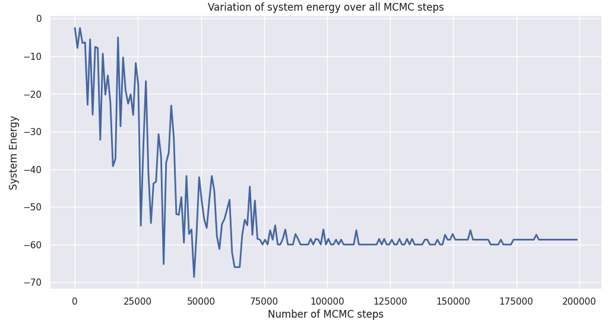

# LatticePy
A python package for MCMC simulations of folding and phase separation in biomolecules on a lattice. LatticePy currently supports the simulation of amino acids and protein polymers on a lattice with any given number of units.

## Installation

### Stable Release
Run the following command in bash (Not on PyPi yet) :

```bash
pip3 install LatticePy
```

### Developers Release
Run the following command in bash:

```bash
pip3 install git+https://github.com/sohitmiglani/LatticePy#egg=LatticePy
```

## Tutorial

### 1. Import the package and initialize the lattice. You can customize the bounds of the lattice, the compactness energy, the beta (1/Temperature), and the lattice type.
```python
from LatticePy import lattice
mylattice = lattice(bound=50, E_c=1.5, beta=0, lattice_type='simple_cubic')
```

### 2. Add your polymer

- By a list of polarities
```python
polymer = [-1, -1, -1, 1, 1, -1, -1, 1, -1, -1, -1, -1, 1, -1, 1, 1, 1, -1, 1, -1, 1, -1, 1, 1, 1, -1, -1]
mylattice.add_polymer_straight(polymer, n_polymers=1) # to add it in a straight line
mylattice.add_polymer_randomly(polymer, n_polymers=1) # to add it in a random fashion which may cause knots
```

- By sequence
```python
sequence = 'MTKSHSEEVIVPEFNSSAKELPRPLAEKCPSIIKKFISAYDAKPDFVARSPGRVNLIGEH'
mylattice.add_protein(sequence, type='straight', n_polymers=1)
```
### 3. Simulate your polymers with annealing

Change the parameters as you see fit
```python
mylattice.simulate(n_mcmc=200000, 
                   interval=1000, 
                   record_intervals = True, 
                   anneal=True, 
                   beta_lower_bound=0, 
                   beta_upper_bound=2, 
                   beta_interval=0.05)
```

### 4. Visualize the energy variation over all the MCMC steps

```python
mylattice.energy_variation_graph()()
```


### 5. Visualize in an interactive 3-D lattice

```python
mylattice.visualize()
```

You can see the interactive 3-D lattice for this run <a target='_blank' href='https://www.sohitmiglani.com/LatticePy_figure'>here.<a/>

### 6. Get important statistics

```python
mylattice.native_contacts
```
20

```python
mylattice.energy
```
-58.7

```python
mylattice.non_covalent_hydrophobic_contacts
```
9
